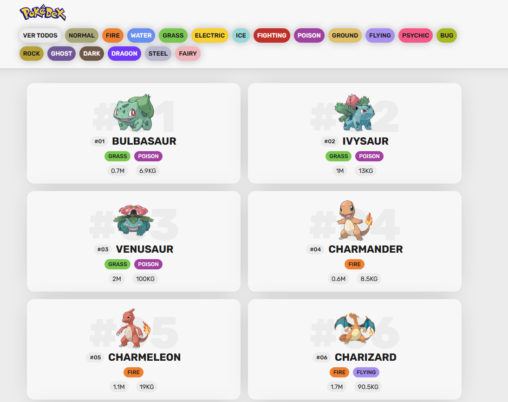

# 👾 Pokédex

Este proyecto es una Pokédex interactiva que permite visualizar información de los primeros 151 Pokémon utilizando la [PokeAPI](https://pokeapi.co/). Los usuarios pueden filtrar Pokémon por tipo o ver la lista completa.



## 📂 Estructura del Proyecto

### Archivos principales:
- **`index.html`**: Contiene la estructura HTML de la página, incluyendo el encabezado, botones de filtro, y el contenedor donde se muestran los Pokémon.
- **`css/main.css`**: Define los estilos de la página, incluyendo diseño responsivo y colores personalizados para cada tipo de Pokémon.
- **`js/main.js`**: Implementa la lógica para obtener datos de la PokeAPI, renderizar los Pokémon en la página, y manejar los filtros por tipo.
- **`img/`**: (Opcional) Contiene imágenes del proyecto, como el logo.

## ✨ Funcionalidades

1. **Visualización de Pokémon**:
   - Muestra los primeros 151 Pokémon con su imagen, nombre, tipos (mostrados con colores distintivos), altura y peso.
   - Los datos se obtienen dinámicamente desde la [PokeAPI](https://pokeapi.co/).

2. **Filtros por tipo**:
   - Botones en el encabezado permiten filtrar Pokémon por su tipo (e.g., 🔥 Fire, 💧 Water, 🌿 Grass, etc.).
   - También incluye un botón para mostrar todos los Pokémon.

3. **Diseño responsivo 📱**:
   - La página se adapta a diferentes tamaños de pantalla, mostrando los Pokémon en una cuadrícula.

## 🛠️ Tecnologías utilizadas

- **HTML5**: Estructura de la página.
- **CSS3**: Estilización, incluyendo diseño responsivo y colores personalizados.
- **JavaScript**: Lógica para consumir la API, manejar eventos y renderizar contenido dinámico.
- **PokeAPI**: Fuente de datos para los Pokémon.

## 🚀 Cómo usar el proyecto

1. Clona este repositorio:
   ```bash
   git clone [https://github.com/unDEVtaker/pokeAPI.git](https://github.com/unDEVtaker/pokeAPI.git)
2. Abre el archivo index.html en tu navegador.
3. Explora la lista de Pokémon y utiliza los filtros para buscar por tipo.

## 📄 Licencia

Este proyecto está bajo la Licencia MIT.

## 👾 Dev

[unDEVtaker](https://github.com/unDEVtaker)


